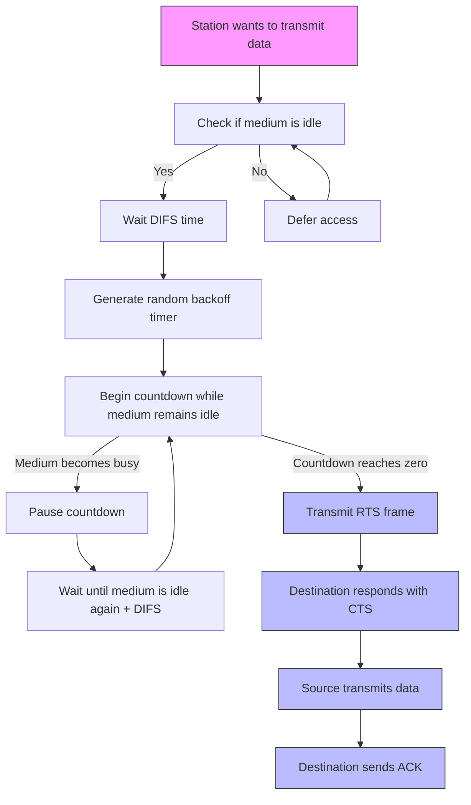

> This section comes under the MAC Section of Data Link Layer

**MAC is three types:**
- Random Access Protocols
	- Aloha
		- Pure Aloha
		- Slotted Aloha
	- CSMA
	- CSMA/CD & CSMA/CA
- Control Access
	- Polling
	- Token Passing
- Channelization Protocols
	- FDMA
	- TDMA

### Pure Aloha
- It is a Random Access Protocol.
- Collision is possible.
- Acknowledgement is there.
- It is LAN based protocol. Currently obsoleted. 
- Transmission Time(TT) = `Message Bits / Bandwidth`
- Vulnerable Time(VT) = `2 x TT`
- Efficiency: `G (no of stations who want to transmit data) x e^(-2G)`
	- **Max Efficiency: 18.4%**

### Slotted Aloha
- Here time is divided into slots and each slot size = transmission time.
- When slot starts at that moment the transmission can be started.
- Collision is possible when multiple stations start transmitting at the beginning of the slot. 
- Vulnerable Time(VT) = Transmission Time(TT)
- Efficiency: `G (no of stations who want to transmit data) x e^(-G)`
	- **Max Efficiency: 36.8%**

### CSMA (Carrier Sense Multiple Access)

- Before transmitting, the station listens to the channel to check if it is idle or busy at the connection. If it is busy, the station waits for a random time and then checks again.

- Types:
    - 1 -Persistent CSMA: 
	    - It continuously checks if the line busy or not. So it has high collision chances.
    - 0 -Persistent CSMA: 
	    - It waits for a random time and recheck if the line busy or not.  This reduces collision chances as compared to 1 -Persistent CSMA but may increase longer waiting time
	    - Example: Ethernet.
    - P-Persistent CSMA: 
	    - hybrid of 0 and 1-Persistent CSMA.
	    - Works based on Probability.
	    - Example: Wifi

### CSMA CD (Carrier Sense Multiple Access Collision Detection)
- Used in LAN, Ethernet.
- No acknowledgement system.
	- While transmitting data if the collision signal comes then the transmitting station can understand that it was the station's data which has been collided.
- Condition: `TT (Transmission Time) > PT (Propagation Time)`
- Worst Case: `TT <= 2 x PT`
- Efficiency: `1 / (1+ 6.44A ) here A = PT / TT`

### CSMA CA (Carrier Sense Multiple Access Collision Avoidance)
- Wireless LAN (WIFI)
- Wireless LAN (WIFI)
- No collision detection.
- Uses collision avoidance mechanism:
- Wireless LAN (WIFI)
- No collision detection.
- Uses collision avoidance mechanism:

The collision avoidance mechanism works by:
1. Checking if channel is idle before transmitting
2. Using RTS (Request to Send) and CTS (Clear to Send) frames
3. Implementing a random backoff algorithm
4. Utilizing NAV (Network Allocation Vector) for virtual carrier sensing

The collision avoidance mechanism works by:
1. Checking if channel is idle before transmitting
2. Using RTS (Request to Send) and CTS (Clear to Send) frames
3. Implementing a random backoff algorithm
4. Utilizing NAV (Network Allocation Vector) for virtual carrier sensing
